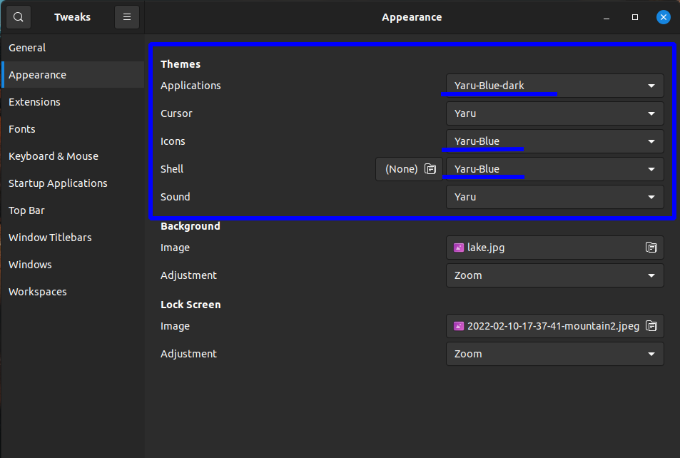

**Yaru-Colors is a theme project to bring different colors to Ubuntu's awesome Yaru theme.**  

[Original Yaru's git](https://github.com/ubuntu/yaru)  

This is awesome. Just use manual install for the least level of intrusion to the system the system.

Use it only for Ubuntu 20.04 LTS. (22.04 and above already offer native additional colors)

Here:

**Manual install:**
1. Copy all the themes into your custom themes directory (`~/.themes`)
2. Copy all icon packs into your custom icons directory (`~/.icons`)
4. Enable your themes with gnome-tweak-tool
5. To change the dock indicator color (Ubuntu's Dash-To-Dock only), find the hex code for your desired color in the list below and enter following two commands (replace HEXCODE with your color code including #):   
`gsettings set org.gnome.shell.extensions.dash-to-dock custom-theme-running-dots-color '#HEXCODE' 2> /dev/null`   
`gsettings set org.gnome.shell.extensions.dash-to-dock custom-theme-running-dots-border-color '#HEXCODE' 2> /dev/null`   

**Example Usage**

**Hex-Color codes of all base colors**   
First color is the Ubuntu-Orange, second the Ubuntu-Purple

| Theme | ORANGE | PURPLE |
| :--- | :---: | :---: |
| Yaru-ORIGINAL |  `#E95420` |  `#762572` |
| Yaru-Amber |  `#eea834` |  `#8c5e11` |
| Yaru-Aqua |  `#41c6c8` |  `#326868` |
| Yaru-Aubergine |  `#77216F` |  `#5e2750` |
| Yaru-Blue |  `#208fe9` |  `#255074` |
| Yaru-Brown |  `#995640` |  `#5e2c12` |
| Yaru-Cinnamon |  `#dd682a` |  `#462e1b` |
| Yaru-Deepblue |  `#25469d` |  `#1a318b` |
| Yaru-Green |  `#3eb34f` |  `#123d18` |
| Yaru-Grey |  `#9c9c9c` |  `#4d4d4d` |
| Yaru-Lavender |  `#6a39cb` |  `#3c1d79` |
| Yaru-MATE |  `#78ab50` |  `#4f6326` |
| Yaru-Orange |  `#e95420` |  `#a6401c` |
| Yaru-Pink |  `#e920a3` |  `#742558` |
| Yaru-Purple |  `#924d8b` |  `#5e2750` |
| Yaru-Red |  `#e92020` |  `#742525` |
| Yaru-Teal |  `#16a085` |  `#094a3d` |
| Yaru-Yellow |  `#e9ba20` |  `#746225` |

**KNOWN BUGS**    
*Some buttons are wrong displayed in Gnome-Shell 40*
In Gnome 40 shell are some "glitches" or wrong looking buttons. This is just because Yaru doesn't support the shell of Gnome 40 officially, yet. As soon as they release the support, I'll update Yaru-Colors as well.

[Workaround](https://github.com/Jannomag/Yaru-Colors/issues/115) for the dock transparency with Gnome 40.

*Transparent window borders*   
Snap applications like Ubuntu Software become transparent.
This isn't really a Yaru-Colors issue. Snap has its own theme directory and I'm not able to add Yaru-Colors to this.
Currently, I don't have any way to create a Yaru-Colors Snap.
There are two solutions:
1) Set Yaru as theme using GTK Inspector - this is just temporary.
2) Completely remove Snap and install Ubuntu Software and other applications via the repositories.
For this there are many tutorials on the WWW.    
***FIX: Install yaru-colors snap package and read above!***

*Missing icons in gnome / failing to apply Yaru-Colors*  
On some distros the icon pack fails to apply (Arch in this case).
Fix by @tur1ngb0x (see issue #55):
1. Install humanity-icon-theme (dependency)
   * Debian/Ubuntu (should be installed by default): `sudo apt install humanity-icon-theme`
   * Arch/Manjaro: `yay -S humanity-icon-theme`
2. Open GNOME Tweak Tool, apply any Yaru-Color icon pack.
3. Restart GNOME Shell.
4. GNOME panel icons will now show applied Yaru icon pack.

*Red checkboxes (mostly nautilus)*    
Install the whole color, not just dark or light.    
So your theme directory has to contain (for example) the directories:    
Yaru-Blue, Yaru-Blue-dark, Yaru-Blue-light.    
Reason: to save space and work the needed asset files are in the default directory only and symlinked from light/dark to default.
